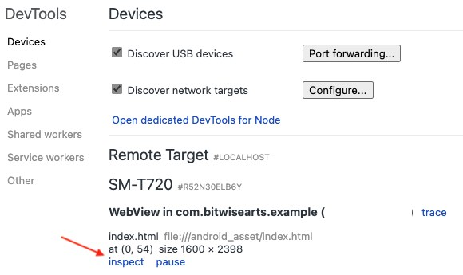
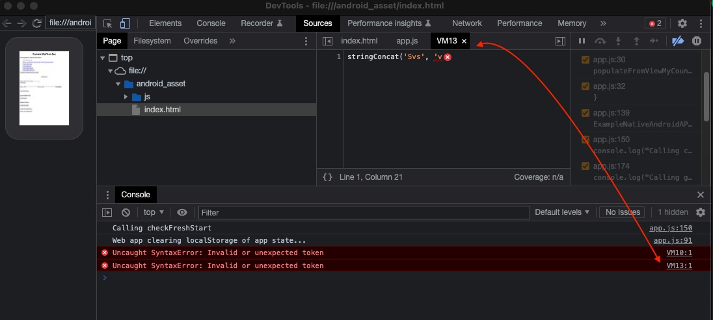

Example of Lean Mobile Web App Running in Android WebView
================================================================================

This app demonstrates how to build a web app using web technologies 
(Javascript, HTML, CSS) that is presented as a mobile web app running in 
[Android's `WebView`](https://developer.android.com/develop/ui/views/layout/webapps).

This app uses [Android JetPack Compose](https://developer.android.com/jetpack/compose).

This example Android app demonstrates:

 1. The setup of a mobile web app provided through `WebView` using [Jetpack Compose](https://developer.android.com/jetpack).
 2. Exposing a native [Android API](app/src/main/kotlin/com/bitwisearts/example/ExampleNativeAndroidAPI.kt) that is callable from the web app
 3. Exposing a [Javascript](app/src/main/kotlin/com/bitwisearts/example/ExampleJavascriptAPI.kt) API that is callable from native Android code.
 4. A server-client message passing protocol between the web app and the native 
    Android code allowing for asynchronous communication.
 5. Managing `WebView` state in the presence of the [Android Lifecycle](https://developer.android.com/guide/components/activities/activity-lifecycle). 

## How to Navigate Example
All example code is well documented. Begin by exploring
[`com.bitwisearts.example.MainActivity`](app/src/main/kotlin/com/bitwisearts/example/MainActivity.kt).

## Web App
The web app is a plain HTML and Javascript application placed in 
[`app/src/main/assets`](app/src/main/assets). It performs all the necessary 
tasks to support this demo; it is not meant to be the magnus opus of web 
applications.

Note that the Javascript is delivered as a single script file and does not 
utilize modern modules to better organize the application. Using modules is 
[not permitted](https://developer.mozilla.org/en-US/docs/Web/JavaScript/Guide/Modules#other_differences_between_modules_and_standard_scripts)
when accessing a web application from the file system using `file:///`.

## Native Android
The native Android portion is developed to support a clear example of a viable
way to deliver a hybrid native Android - mobile web app. No effort was put forth
on themes nor any real work on UI/UX other than what is needed to demonstrate a
way to deliver a hybrid app. 

The native API exposed to Javascript is located in 
[`ExampleNativeAndroidAPI`](app/src/main/kotlin/com/bitwisearts/example/ExampleNativeAndroidAPI.kt).

It utilizes coroutines to execute asynchronous code. Note that all calls to 
execute Javascript code from native Android must be done on the UI thread.

## Project Setup
This example presumes the viewer understands how to setup an Android project.
It is possible to start with Android Studio's new project wizard, choosing to
create a new [Jetpack Compose](https://developer.android.com/jetpack) project.

### AndroidManifest
Much of the project setup involving the [`AndroidManifest`](app/src/main/AndroidManifest.xml) 
file relates to things such as `user-permission`. It is presumed that those 
viewing this example are familiar with the [Android manifest file](https://developer.android.com/guide/topics/manifest/manifest-intro).
Some comments were added in the manifest file, but the aim of this example is 
not to instruct viewers on the ins and outs of this file.

### Gradle
Android Studio generates projects using Groovy Gradle files. It is my preference 
to use the [Gradle Kotlin DSL](https://docs.gradle.org/current/userguide/kotlin_dsl.html).
This is a personal preference as I have over 5 years experience writing Kotlin
while my Groovy experience is limited to Gradle file manipulation over the years
before Gradle Kotlin DSL was available. I always transform generated Groovy Gradle 
files to Kotlin DSL at the start of every project, however, this is not necessary. 
If you are more comfortable with Groovy, stick with Groovy for Gradle.

### Permissions
There are various [permissions](https://developer.android.com/guide/topics/permissions/overview)
that require setup in a `uses-permission` tag in the `AndroidManifest` file. The
[permission requirements](https://developer.android.com/reference/android/Manifest.permission)
will vary for your Android app depending on the Android resources used.

See the [`AndroidManifest`](app/src/main/AndroidManifest.xml) file to view
permissions used by this example application.

Additionally, some permissions must be granted by the user. Requesting this
permission is handled by the `Composable` function, 
`ConditionallyRequestPermission`. This function is defined at the bottom of
[`MainActivity`](app/src/main/kotlin/com/bitwisearts/example/MainActivity.kt).

## Preserve State
If the state is not actively preserved, the `WebView` will be reset to the start
page on events such as a screen rotation or a change in the size of the screen.

A `LifecycleEventObserver` is added to manage the saving of `WebView` state. This
can be found in [CustomWebView](app/src/main/kotlin/com/bitwisearts/example/CustomWebView.kt).

Using a mix of Android [`Bundle`](https://developer.android.com/reference/android/os/Bundle) 
and [`Window.localStorage`](https://developer.mozilla.org/en-US/docs/Web/API/Window/localStorage)
we can preserve state on both sides during lifecycle events. 

The web app uses the class, [`AppDataContext`](app/src/main/assets/js/app.js),
to manage the web application state that must be persisted.

**WARNING** Data stored in `Window.localStorage` persists between runs of the 
app so special care needs to be taken to clean up `localStorage` when the data
is no longer needed. There is no lifecycle event in Android that can be used to
trigger clearing `Window.localStorage` when the app closes. To accomplish this
the application clears app data from `Window.localStorage` at app startup.
Review the function, `checkFreshStart()` in `app.js` to trace how this works.

It should be noted that the [web app](#web-app) doesn't use a framework which
provides more flexibility in how it manages its own state, but it does require 
more work to manage said state. State management considerations would have to be
made if the web app were built using a framework like Angular or React.

## Communication
Communication between the native Android code and the web code in the `WebView`
is fairly limited. The `JavascriptInterface` annotation provides a kind of 
foreign function interface that allows the web app to make native Android 
function calls from Javascript. The `WebView` allows for the evaluation of
arbitrary `Javascript` using [`WebView.evaluateJavascript`](https://developer.android.com/reference/android/webkit/WebView#evaluateJavascript).

This is limited in that there is no way natively to preserve callbacks on either
side that can be triggered asynchronously when the API being called must 
process something asynchronously before returning it (open a file, or scan a 
barcode). Because of this, we have to effectively model communication as we 
would using bidirectional communication over a socket (*think server-client over
WebSockets*). This has to be designed so that requests being processed 
asynchronously survive lifecycle events. 
(*see [Preserve State](#preserve-state)*)

The web app manages asynchronous requests through [`AndroidAPIRequests`](app/src/main/assets/js/app.js)
that are stored in `AppDataContext.conversations`. See [`ApiMessages`](app/src/main/kotlin/com/bitwisearts/example/ApiMessages.kt)
to see how the native Android code handles asynchronous API requests from the
web app.

Another approach not used in this example involves using [`MessagePort`](https://developer.mozilla.org/en-US/docs/Web/API/MessagePort).
Android introduced [`WebMessagePort`](https://developer.android.com/reference/android/webkit/WebMessagePort)
in API 23. Using this would be akin to using WebSockets in a server-client 
architecture where the Android native would act as the server and the web app in 
the `WebView` as the client. A notable limitation here is that `WebMessagePort` 
can only pass string data (*no binary support*). Cursory research didn't turn up
anything of note in terms of `WebMessagePort` usage in Android.

## Navigation
Realistically navigation can be handled in one of three of ways:

1. Use a `NavHostController` in a call of `NavHost` to enable jump navigation
   between `Composables`, each one its own tree of possible recompositions to
   deliver a UI based on the view state.  
2. Use a single root `Composable` with a global view data object that manages
   what is expected to be displayed. This effectively takes the disparate views
   from option 1 and places them all under the same `Composable` root. You still
   need a `NavHostController` to create a custom `BackHandler` for navigating
   the appropriate back stack (`WebView.goBack` vs `NavHostController.popBackStack`).
   This simplifies state management.
3. A hybrid approach of options #1 & #2.

The challenge with navigation is preserving `WebView` state. Some Android 
utilities, such as the camera or a barcode scanner, depending on how they are
launched, may cause the `WebView` to be destroyed.

For this example, we use option 1 from above. We use the `Application` subclass
[`WebApp`](app/src/main/kotlin/com/bitwisearts/example/WebApp.kt) to manage
async message state in the field, `WebApp.responseQueue`. The comment for this
field indicates better solutions than this, but for this example, it is "*good
enough*".

## Debug
There are two tools used to debug an Android application that uses a `WebView`,
Android Studio and the Chrome web browser.

### Android Studio
It is presumed you are familiar with standard Android development and the usage
of the [debugger](https://developer.android.com/studio/debug) in Android Studio.

### WebView Debug in Chrome
The Chrome web browser has [debugging tools](https://developer.chrome.com/docs/devtools/remote-debugging/) 
that can be used to debug your web app running in the `WebView`. To do this:

1. Connect your Android device to your computer
2. Start the Android app
3. Open a Chrome web browser
4. Navigate to [chrome://inspect/#devices](chrome://inspect/#devices)
5. Click the `inspect` link under your device to open the standard Chrome development tools.



### Debug Note of Importance
Malformed Javascript calls from native Android code using 
`WebView.evaluateJavascript` will be reported differently. Logged web messages
that are captured by a custom `WebChromeClient` and logged using Logcat are useless.
They are reported as:
```
E/WebViewConsole: (file:///android_asset/index.html: ERROR) Line number: 1
    Uncaught SyntaxError: Invalid or unexpected token
```
where `index.html` is the file being displayed in the `WebView`. The line number
provided is actually the line number in the evaluated Javascript that failed. So
evaluating the following script will report the error on line 5:

```kotlin
WebView.evaluateJavascript("\n\n\nstringConcat(\n\t'Dvdb', 'v;")
```

The Chrome debug console is where you want to debug this. The Javascript being 
run using `WebView.evaluateJavascript` is executed in a VM (*Virtual Machine*). 
The engine doesn't know where the script came from, so it assigns it a number 
and prefixes it with `VM`. Clicking on the error in the console opens up a 
window showing the exact script that failed to execute.

